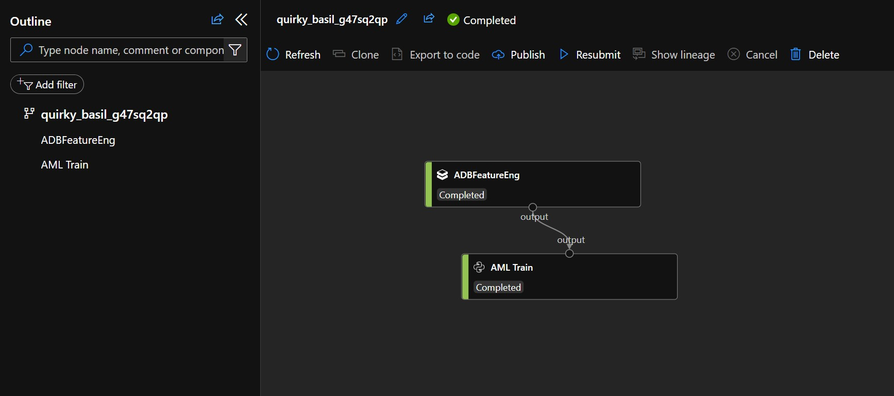

## Use of Azure ML Dataset as an approach to data mesh

In this notebook, I'll demonstrate how to leverage Azure ML Datasets to approach a data mesh strategy for any model development activity across different compute targets, databricks or entirely on AzureML.

*The AML Piepline Image*

To read more, please check this notebook: [pipeline_def.ipynb](./pipeline_def.ipynb)